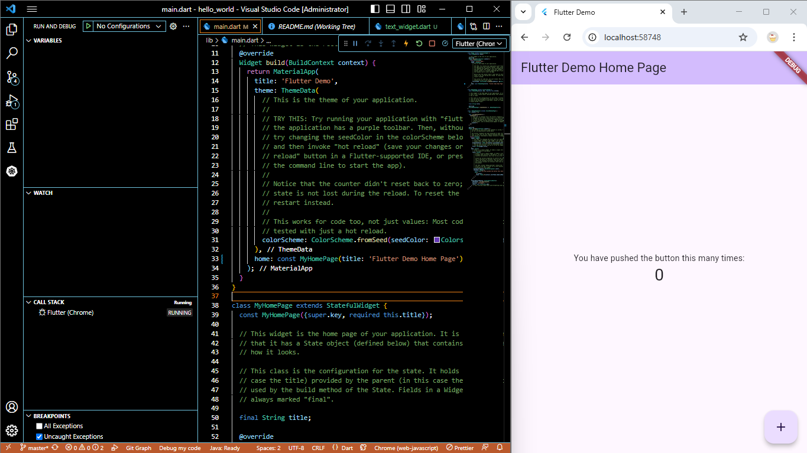
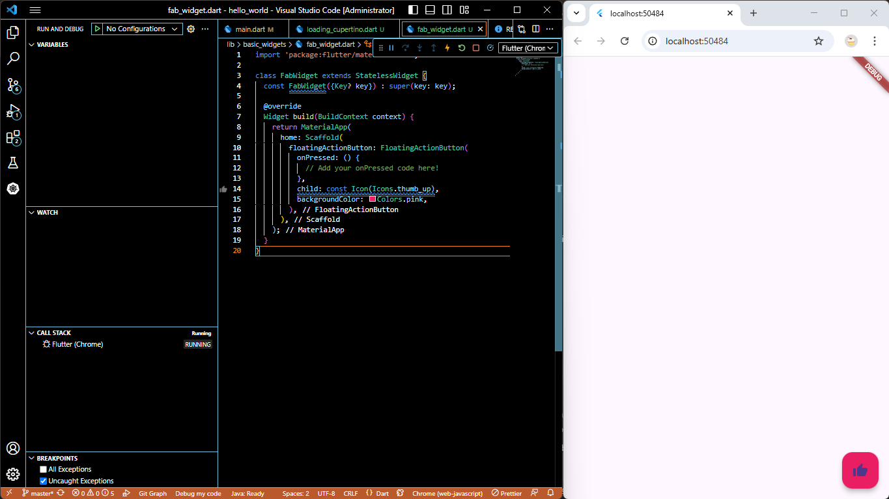

# Hello World - Flutter Project

**Nama:** Saria Fauzani  
**NIM:** 2341760178  

A new Flutter project untuk pembelajaran dasar Flutter.

## Screenshot Hasil Jobsheet Flutter 1

## Praktikum 3

### Langkah 12: Hello World

---

## Praktikum 4

### Langkah 1: Text Widget

### Langkah 2: Image Widget

---

## Praktikum 5

### Langkah 2: Button Widget

### Langkah 3: Scaffold Widget

### Langkah 4: Dialog Widget
  

### Langkah 5: Input dan Selection Widget
  

### Langkah 6: Date and Time Pickers
  

